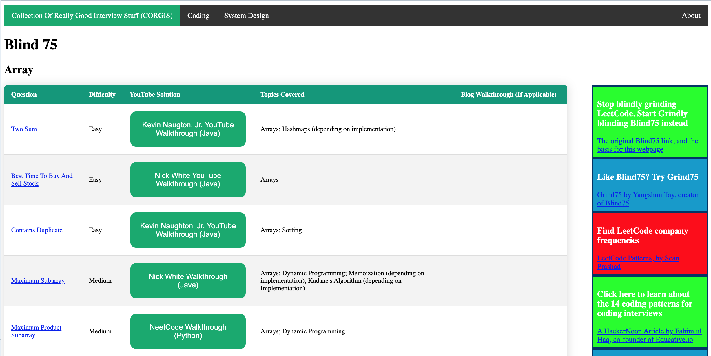

# CollectionOfReallyGoodInterviewStuff (CORGIS)

## Quickstart

https://evansoohoo.github.io/CollectionOfReallyGoodInterviewStuff/

## Notes

Instead of solving thousands of LeetCode questions, candidates can solve 75 questions that are ordered by pattern. This list was originally compiled by Yangshun Tay and there are a number of solution playlists available, including a single playlist by NeetCode.

NeetCode is great, but he generally uses Python.  My selection criteria was
Kevin Naughton over Nick White, and Nick White over NeetCode, with a few exceptions.  I also included BackToBack SWE at times - they are the best, in my opinion, but their focus is more on concepts than on jumping right into problems.  I also enjoy Take U Forward, who uses C++, but he seems to come up less often.

## Why Blind75?

Paradox Of Choice, really.  I doubt the list is much better or worse than the one on 14 Coding Patterns, but any curated list is better than trying to do everything or nothing - one notable thing about the 14 Coding Patterns, though, is that it completely overlooks dynamic programming.
